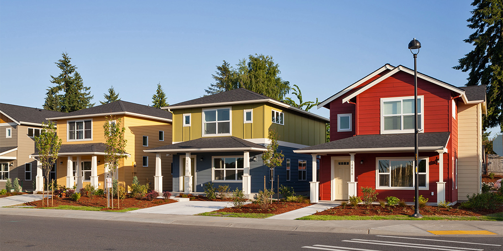
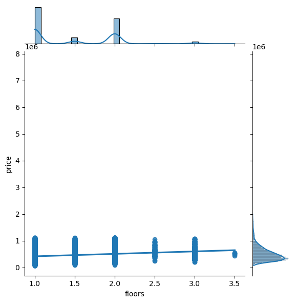

# MODELLING HOUSE PRICES USING DIFFERENT HOUSE FEATURES IN KING COUNTY.

# 1.0 Project Overview/Business understanding.
## 1.1 Introduction
Owning a home is a significant financial decision. Understanding factors that influence house prices can empower both buyers and sellers to make informed choices. However, accurately determining a property's value can be complex due to various factors influencing house prices.

To gain insights into these factors, this study will analyze and model a dataset of house prices in King County. This analysis will focus on key factors such as square footage, number of bedrooms, number of bathrooms, and other property features like lot size. By leveraging data analysis, we aim to uncover the specific impact of these factors on property valuations and identify the most influential factors driving house prices. Additionally, we will investigate how these factors correlate with each other.

This study aims to provide valuable insights for both homeowners and potential buyers in King County by identifying the key drivers of house prices and their relationships.

## 1.2 Problem statement

Home sellers and buyers often struggle to determine the optimal pricing and value of a property. This project aims to analyze a dataset of homes sold in king county focusing on house prices and features like square footage, number of bedrooms, and neighborhood amenities. By understanding the relationships between these features and sale prices, we can develop insights to:

1. Advise sellers (homeowners or developers) on data-driven strategies to enhance their properties for maximum sale price.
2. Equip buyers with a clearer understanding of factors impacting home value, empowering them to make informed decisions during the buying process.

# 1.3 Objectives
# 1.3.1 Main objective
 
 Build and evaluate models using various combinations of the available house features in King County.

# 1.3.2 Specific objectives

1. Evaluate how the number of floors impact the price of a house in King County.
2. Determine how the number of bedrooms impact the price of a house in King County.
3. Examine the impact the number of bathrooms has on the price of a house in King County.
4. Assess the impact of renovations on the price of a house in King County.
5. Determine how the square footage of living space of a house impacts house price in King County.
6. Evaluate which combinations of the available features in the dataset are the most impactful features for predicting sale price.

# 2.0 Data Understanding.
The dataset provided is ("kc_house_data.csv").The timefarme of the data is 2014 to 2015.It had 21,597 rows and 21 columns.Our dataset contained numerical and categorical variables.Each row consists of an individual house, indexed by a unique house id.

# 2.1 Data Preparation
We checked for null,duplicate values,outliers and later dropped them. We also transformed the column'yr_renovated' to 'house_renovation'.For the waterfront column we changed the output from NaN to none. Checked for null values in our cleaned data frame and found some in the view column which we dropped.

# 3.0 Data Analysis
Delved into the intricate web of factors influencing house prices in King County through Exploratory Data Analysis (EDA).

# 4.0 Modelling
Model building began with checking the distribution of price.
Checking for linearity:

The image above ascertains linearity between sqft_living and the target variable'Price'.Our results show that our feature is linear.
 Checking for multicollinearity:
 From our findings: features with VIF values greater than 5 (sqft_living and sqft_above) are concerning because they exhibit a high multicollinearity. The others exhibit a multicollinearity effect that is not problematic.
# 4.1 Regression.
 Simple linear regression:
 1. Baseline model:
 -Analyzed how the size of living space affected  the price
 Square foot living only predicted price with a 33.9% accuracy.
 2. Price vs Bedrooms
Analyzed how the number of bedrooms  affected  the price.
Number of bedrooms could only account for 7.3 %  accuracy
3. Price vs Number of floors.
Checked if number of floors could have any effect on house prices.
It had a minimum effect on the price 
Number of floors  could only account for 6.2 %  accuracy
Performed poorly compared to previous model.

Multiple linear regression:
1.price vs no of bedrooms, sqftliving, floors.
Combined all the feature to see if we could get a better model.
Model price vs the other features(sqft living, bedrooms, floors)
Noticed that we had a better model overall that predicted price with a 35.3% (adjusted r-squared) accuracy
Also for every one unit change in sqft_living ,then the price of the house increases 
Also for every one unit change in the number of bedrooms, then the price of the house decreases

# 5.0 Conclusions
We managed to meet our main and specific objectives.The results shows that the more the number of floors the higher the house price,the less the number of bedrooms the higher the house price and the Bigger the square foot living the higher the house price 

# 6.0 Recommendations
1. Homeowners to focus on properties with a lower bedroom count so that in return it will lead to an increase in price of the house.

2. Increasing the living space generally increases the house price.

3. For stakeholders,if feasible, explore opportunities to add or emphasize multiple floors in properties to increase their price value.
